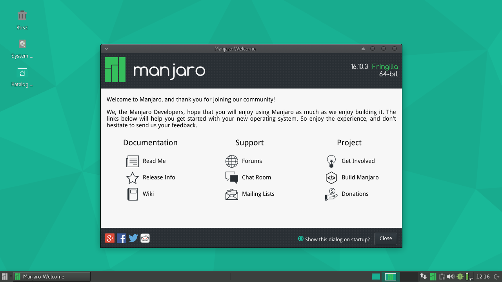
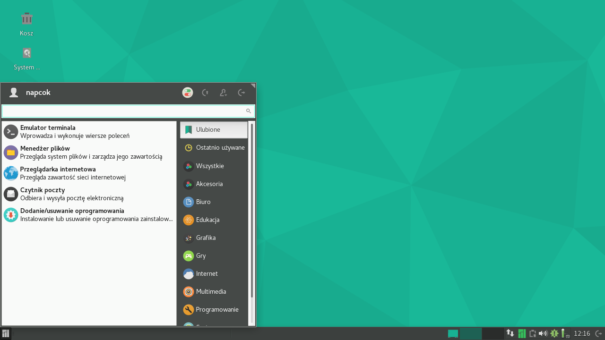
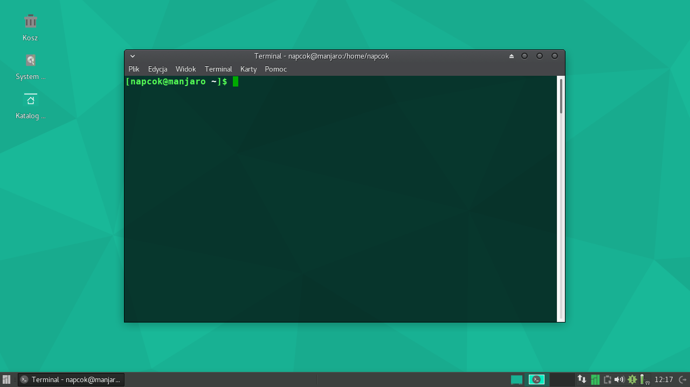
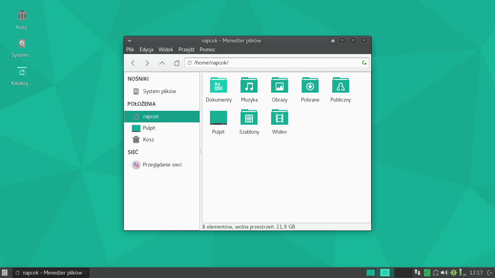
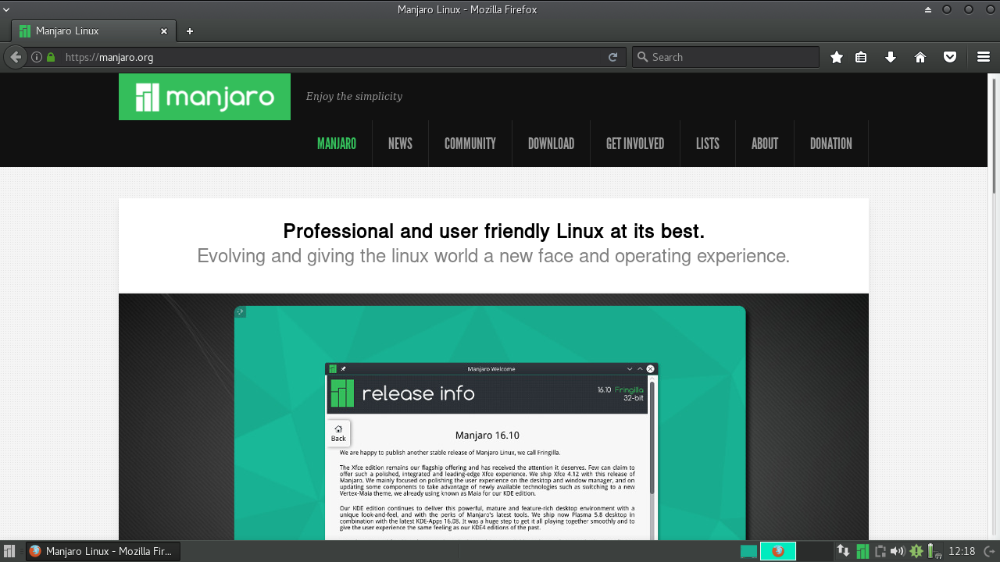
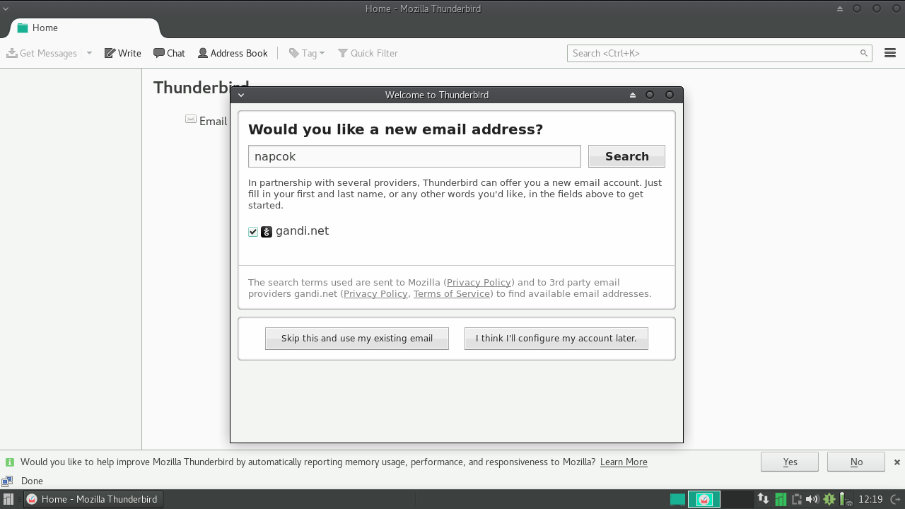
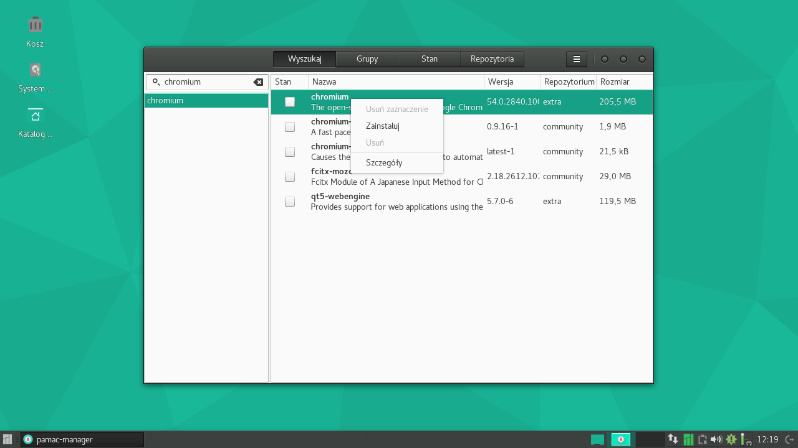
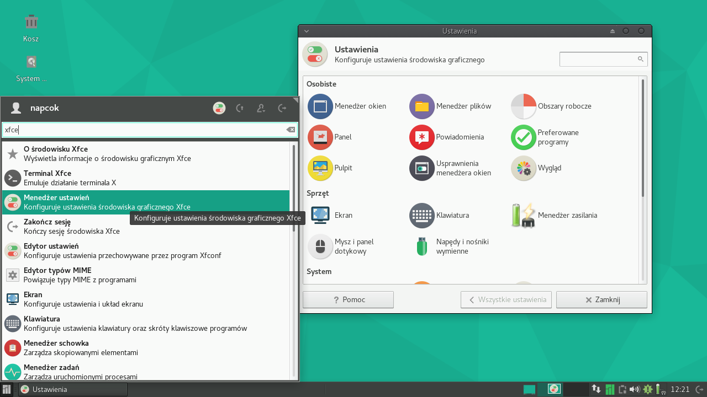
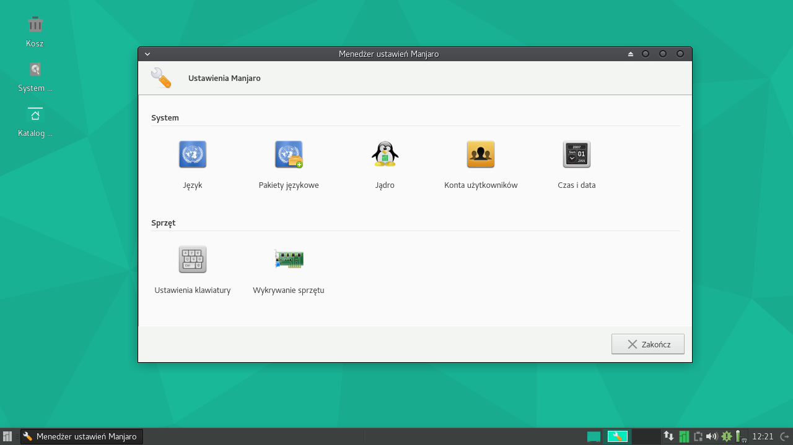

#Pulpit Manjaro

*Gratulujemy zainstalowania Manjaro Linux!*

Po pierwszym zalogowaniu zobaczysz ekran powitalny.
Ekran powitalny uruchomi się automatycznie i zaprezentuje Ci kilka użytecznych linków, do dokumentacji, sposoby uzyskania pomocy oraz wsparcia ze strony społeczności Manjaro oraz przedstawi w jaki sposób możesz się zaangażować w projekt. Pamiętaj, że Manjaro jest wolnym i otwartym oprogramowaniem: istnieje dzięki wsparciu społeczności użytkowników oraz pracy deweloperów!

1: Pulpit Xfce oraz Ekran Powitalny

Jeśli nie chcesz aby Ekran Powitalny uruchamiał się przy każdym logowaniu po prostu odznacz opcję **Pokazuj przy każdym uruchomieniu**. Zawsze będziesz mógł znaleźć i uruchomić ten ekran z menu aplikacji.

Menu (startowe) jest najłatwiejszym sposobem uruchamiania oprogramowania, które zostało zainstalowane wraz z systemem. Ikona menu znajduję się w rogu ekranu. Nie czekaj, kliknij w nią już teraz!

*Możesz również wcisnąć klawisz 'Windows' lub 'Super'. Wygodne!*

2: Zainstalowane programy będą pokazane w menu 

Jak widzisz pięć przydatnych aplikacji znajduje się w sekcji *Ulubione*. Pozwala to na szybki dostęp do programów, których najczęściej używasz. Aby dodać lub usunąć program do/z Ulubionych po prostu kliknij prawym przyciskiem myszy i wybierz odpowiednią opcję.

Teraz przyjrzymy się po kolei tym pięciu programom...

*Emulator Terminala*

5: **Emulator Terminala** zwany też terminalem lub konsolą, pozwala ci wykonywać komendy tekstowe (polecenia). Mimo, że na początku może się wydawać niezbyt przyjazny, jest to niesamowicie potężne narzędzie i pozwala wykonać czynności, które bardzo trudno jest wykonać za pomocą programów z graficznym interfejsem (GUI). W tym przykładzie zostały wylistowane (ls) pliki w katalogu domowym.
Znajomość obsługi terminala nie jest konieczna do korzystania z Manjaro, jednak naprawdę warto się jej nauczyć.

*Menedżer plików*

6: **Menedżer plików** jest graficznym interfejsem do zarządzania twoimi dokumentami i katalogami. Większość menedżerów plików działa w podobny sposób; jeśli używałeś innego, prawdopodobnie dasz sobie radę i z tym!

*Przeglądarka Internetowa*

7: Czym jest przeglądarka internetowa każdy wie :)
Jeśli masz ulubioną przeglądarkę możesz ją łatwo doinstalować.

*Czytnik Mail*

*Dodaj/Usuń Programy*

9: **Menedżer Pakietów** pozwala na wyszukiwanie, instalowanie oraz usuwanie oprogramowania. W tym przykładzie wyszukano przeglądarkę Chromium. Są dwie graficzne nakładki na menedżera pakietów: **Pamac** (zainstalowany w edycji z XFCE) oraz **Octopi** (zainstalowany w edycji KDE). Instalacja programów jest omówiona szczegółowo w rozdziale **Instalacja oprogramowania**

###Dostrajanie systemu

*Zmiana ustawień*

Manjaro domyślnie jest skonfigurowane tak, aby umożliwić wygodną pracę. Możesz jednak chcieć zmienić niektóre rzeczy jak np. tapetę, schemat kolorów czy też zachowanie touchpada w laptopie.

*Menedżer ustawień Xfce*

1: Środowisko Xfce jest bardzo konfigurowalne, co znaczy że możesz je dostosowywać do własnych potrzeb. Do ustawień pulpitu użytkowika można się dostać za pomocą menu oraz Menedżera Ustawień Xfce. Tak czy owak, możliwe jest dostosowanie do swoich potrzeb bardzo wielu aspektów działania środowiska! Nie obawiaj  się: zmiany tutaj wprowadzone będą dotyczyć tylko ustawień dla twojego konta użytkownika, a nie dla innych kont użytkowników, które z łatwością możesz utworzyć.

*Menedżer Ustawień Manjaro*

2: **Menedżer Ustawień Manjaro** dostarcza zestawu narzędzi do zmiany bardziej nisko-poziomowych ustawień, jak takich jakie ustawiałeś podczas instalacji. Domyślny język w systemie, ustawienia klawiatury, konta użytkowników, sterowniki dla urządzeń to wszystko możesz ustawiać za pomocą tego narzędzia.