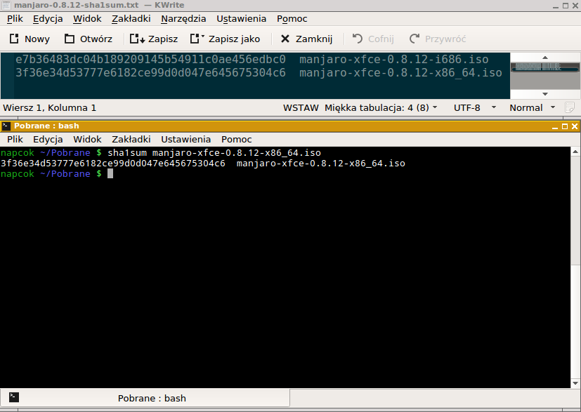
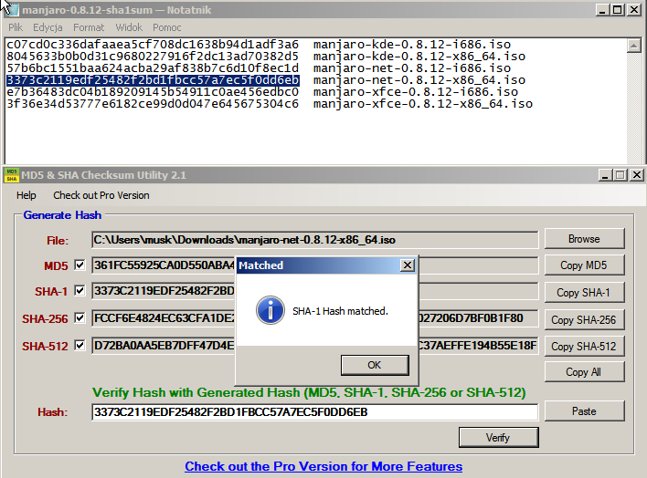

# Sprawdzenie sum kontrolnych MD5

Zanim wypalimy pobrany obraz dysku (lub użyjemy go jako wirtualnego dysku w VirtualoBox) należy sprawdzić czy został on poprawnie pobrany. Naprawdę zalecamy sprawdzić integralność obrazu przed jego użyciem, ponieważ skutki użycia uszkodzonego dysku mogą być fatalne. W najlepszym przypadku instalacja nie powiedzie się. Może też się zdarzyć, że uszkodzony obraz iso spowoduje, że zainstalowany system będzie uszkodzony.

Aby zweryfikować integralność pobranego obrazu musimy pobrać pliki zawierające jego sumy kontrolne. Są one dostępne na serwerze z którego pobieramy obrazy iso. Przykładowo plik **manjaro-0.8.12-sha1sum.txt** zawiera sumy kontrolne dla wszystkich dostępnych obrazów iso. Jego zawartość powinna być podobna do listingu:

```
c07cd0c336dafaaea5cf708dc1638b94d1adf3a6  manjaro-kde-0.8.12-i686.iso
8045633b0b0d31c9680227916f2dc13ad70382d5  manjaro-kde-0.8.12-x86_64.iso
57b6bc1551baa624acba29af838b7c6d10f8ec1d  manjaro-net-0.8.12-i686.iso
3373c2119edf25482f2bd1fbcc57a7ec5f0dd6eb  manjaro-net-0.8.12-x86_64.iso
e7b36483dc04b189209145b54911c0ae456edbc0  manjaro-xfce-0.8.12-i686.iso
3f36e34d53777e6182ce99d0d047e645675304c6  manjaro-xfce-0.8.12-x86_64.iso
```

### MD5 oraz SHA-1
Są dwa rodzaje plików zawierających sumy kontrolne. Pierwszy kończy się na **-sha1sum.txt**, drugi na **-md5sum.txt**. MD5 oraz SHA to dwa typy kryptograficznych funkcji skrótu; cząstka **sha** w nazwie pliku pochodzi od **Secure Hash Algorithm**. Algorytmy te są używane do generowania unikalnego skrótu (hash code) dla każdego pliku iso z obrazem dysku. Sam plik z sumami kontrolnymi to plik tekstowy zawierający hashkody (skróty), które powinny odpowiadać kodom wygenerowanym przez algorytm MD5 lub SHA-1. Pobrane pliki mogą być sprawdzone czy są identyczne z tymi na serwerze - jeśli plik uległ zmianie, np. z powodu błędów podczas pobierania wygenerowany kod będzie inny.

### Sprawdzanie sum kontrolnych na Linuksie


Przykładowo jeśli pobraliśmy obraz iso do katalogu `Pobrane`, musimy do niego wejść:

```
cd Pobrane
```
oraz wygenerować sumę kontrolną obrazu iso poleceniem:

Dla sumy sha1:
```
sha1sum manjaro-xfce-0.8.12-x86_64.iso
```
Dla sumy md5:
```
md5sum manjaro-xfce-0.8.12-x86_64.iso
```

Polecenia wygenerują sumy kontrolne dla 64 bitowego obrazu iso Manjaro Xfce 0.8.12. Należy je porównać z tymi zawartymi w pliku z sumami kontrolnymi.

### Sprawdzanie sum kontrolnych na Windows

System Windows domyślnie nie udostępnia narzędzi do sprawdzania sum kontrolnych, dlatego też musimy pobrać i zainstalować odpowiednią aplikację.

Jednym z takich programów posiadających pozytywne recenzje jest **Raymond's MD5 & SHA Checksum Utility**. Programik można pobrać ze strony Download.com http://download.cnet.com/MD5-SHA-Checksum-Utility/3000-2092_4-10911445.html



Weryfikacja sumy kontrolnej za pomocą tego programu jest bardzo łatwa. Klikamy **Browse**, odnajdujemy pobrany obraz iso i klikamy **Open**. Program obliczy sumy kontrolne dla naszego obrazu iso. Aby sprawdzić czy sumy kontrolne się zgadzają otwieramy plik **manjaro-0.8.12-sha1sum.txt** w Notatniku, kopiujemy z niego sume kontrolną dla pliku iso ktory pobraliśmy i wklejamy do pola **Hash**. Klikamy **Verify**. Jeśli sumy się zgadzają program poinformuje nas o tym komunikatem: **Hash matched**.
