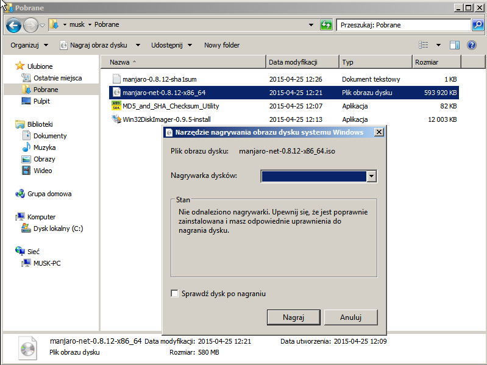

# Nagrywanie ISO na DVD/USB

Obraz iso to specyficzny plik, który reprezentuje bit po bicie pliki oraz katalogi, które mają się znaleźć na płycie instalacyjnej lub urządzeniu USB. Dlatego też nie można po prostu skopiować obraz iso na płytę CD lub pendriva. Należy użyć programu nagrywającego lub narzędzia zapisującego obraz dysku na USB, za którego pomocą surowe dane z obrazu iso zostaną przekształcone z katalogi i pliki na instalacyjnej płycie CD/DVD lub instalacyjnym dysku USB.

*Jeśli chcesz przetestować Manjaro za pomocą VirtualBox, nie ma potrzeby wypalania obrazu iso na płytę lub USB. VirtualBox jest w stanie zainstalować system bezpośrednio z pliku iso.*

Po nagraniu płyty lub utworzeniu bootowalnego USB można uruchomić z niego Manjaro w trybie **live**. Należy tu wspomnieć, że system uruchomiony w trybie live nie jest w pełni funkcjonalny, przykładowo nie można na nim zapisywać plików, dokonywać aktualizacji czy też instalować oprogramowania.

Obrazy instalacyjne zawierają sporo przydatnego oprogramowania, z tego też powodu możesz potrzebować płyty DVD zamiast CD aby je wypalić. Przykładowe rozmiary plików iso:

|Edycja|Nazwa pliku|Rozmiar|Płyta|
|:---:|:---:|:---:|:---:|
|KDE|manjaro-kde-15.12-i686.iso| 1.8GB|DVD|
|XFCE|manjaro-xfce-15.12-i686.iso| 1.5GB|DVD|
|Net|manjaro-net-15.12-i686.iso| 560MB|CD|

Wiele osób używa płyt DVD nawet do nagrywania obrazów mieszczących się na CD.

W ostatnich latach gdy pendrivy stały się powszechne oraz bardzo potaniały, coraz częściej są one wykorzystywane zamiast płyt CD/DVD do instalacji Linuksa na twardym dysku. Jeśli twój komputer posiada możliwość bootowania z USB polecamy tą metodę.

Poniżej opisane jest zarówno wypalanie płyt instalacyjnych CD/DVD jak i tworzenie bootowalnego dysku USB pod systemami Linux oraz Windows.

## Wypalanie CD/DVD pod Linuksem

Zazwyczaj w systemach Linux domyślnie instalowany jest jakiś program służący do nagrywania płyt CD/DVD. Jeśli tak nie jest można łatwo go doinstalować korzystając z menedżera pakietów lub Centrum Oprogramowania. Popularne programy do wypalania to **XFBurn**, **K3b** oraz **Brasero**. Poniżej opisujemy krok po kroku proces wypalania obrazu iso za pomocą Brasero.

#### Wypalanie CD/DVD za pomocą Brasero
1. Wkładamy czystą płytę CD/DVD do napędu.
2. Uruchamiamy program **Brasero**.
3. Klikamy **Nagraj obraz - Nagranie gotowego obrazu CD/DVD na płycie**.
4. Wybieramy obraz iso do nagrania.
5. Czysta płyta którą włożyliśmy do napędu powinna być dostępna do wybrania poniżej etykiety **Proszę wybrać płytę do nagrania**. Jeśli nie, należy kliknąć przycisk i wybrać ją ręcznie.
6. Klikamy na **Właściwości** i wybieramy najniższą z możliwych prędkość nagrywania.
7. Klikamy **Nagraj**.


## Wypalanie CD/DVD pod Windows

Nowsze wersje Windows (Windows 7 oraz późniejsze) zawierają domyślnie program do nagrywania płyt CD/DVD. Jeśli posiadasz starszą wersję Windows musisz pobrać jedną z wielu dostępnych aplikacji do nagrywania.

#### Wypalanie za pomocą domyślnego narzędzia
Wybranie obrazu iso oraz kliknięcie **Nagraj obraz dysku**, lub po prostu dwukrotne kliknięcie pliku iso spowoduje uruchomienie **Narzędzia nagrywania obrazu dysku systemu Windows**.



#### Inne programy do nagrywania pod Windows
Jeśli posiadasz starszą wersję Windows, np. Windows XP musisz pobrać i zainstalować jakiś program do nagrywania.
Kilka popularnych i darmowych programów pod Windows:

|Nazwa|Strona WWW|
|:---:|:---:|
|Imgburn|http://imgburn.com|
|CDBurnerXP| http://cdburnerxp.se/en/|
|InfraRecorder|http://infrarecorder.org/|


## Tworzenie bootowalnego dysku USB pod Linuksem

### Z lini komend
Aby *wypalić* obraz iso na USB, wykonaj w terminalu następujące polecenie:  

```
dd bs=4M if=/sciezka/do/manjaro.iso of=/dev/sd[litera dysku]
```
Gdzie [litera dysku] jest literą twojego urządzenia przenośnego. Zauważ, że jest to **urządzenie** (dysk) np. /dev/sdb, a **nie** numer partycji znajdującej się na dysku.

Aby znaleźć literę dysku wykonaj polecenie:

```
fdisk -l
```
*Uwaga!  
Wszystkie dane znajdujące się na USB zostaną utracone.*

### Za pomocą programów z GUI

Tworzenie bootowalnego dysku USB można także wykonać za pomocą programów z graficznym interfejsem jak np. **ImageWriter** czy **isousb**.

## Tworzenie bootowalnego dysku USB pod Windows

Godnym polecenia programem jest **ImageWriter for Windows**, który obsługuje oprócz urządzeń USB także karty Compact Flash (CF) oraz Secure Digital (SD). Po pobraniu programu upewnij się, że podłączyłeś swoje urządzenie USB zanim uruchomisz program.

Jeśli ImageWriter nie startuje, być może będziesz musiał pobrać i zainstalować Microsoft .NET 2.0 Runtime Framework. Zwykle jest on już jednak zainstalowany w systemie.

Dodatkowo w systemach Windows Vista i nowszych może pojawić się komunikat błędu. W takim przypadku program trzeba uruchomić poprzez prawoklik na ikonie i wybranie opcji **Uruchom jako Administrator**.


