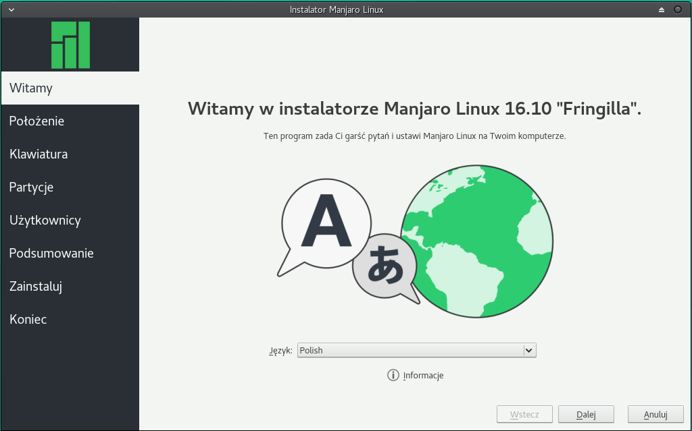

# Automatyczna instalacja w systemach BIOS za pomocą instalatora Calamares

Graficznym instalatorem w Manjaro jest Calamares. Za jego pomocą mamy możliwość wyboru trzech zautomatyzowanych opcji instalacji, które poniżej omówimy w szczegółach. Manualna instalacja jest przedstawiona w rozdziale **[Manualna instalacja w systemach BIOS za pomocą instalatora Calamares](./installBIOSmanual.md)**

**Wyczyść cały dysk i pozwól instalatorowi Calamares ustawić partycje.**

Najprostszą wersją instalacji jest nadpisanie całego dysku i pozwolenie instalatorowi na utworzenie domyślnych partycji dla waszego nowego systemu operacyjnego. To odpowiednia metoda jeśli chcesz zacząć od początku, gdyż wszystkie informacje na dysku zostaną skasowane. Jeśli chcesz je zachować, możesz skopiować dane na dysk zewnętrzny i przywrócić po instalacji.

*Wybierz swój język*

1: Pierwszym ekranem po uruchomieniu instalatora jest wybór języka z menu. Dodatkowo jeśli nie jesteście podłączeni do Internetu pojawi się na tym ekranie ostrzeżenie.

***

*Wybierz swoją lokację*

2: Możesz wybrać swoją strefę czasową albo klikając na pobliski rejon na mapie, albo wybierając region i strefę z menu.

***

3: Jeśli klikniesz na przycisk "Zmień..." pojawi się menu, które pozwala na wybranie systemowych ustawień lokalnych, które wpływają na ustawienia języka i znaków w niektórych elementach wiersza poleceń interfejsu użytkownika. Dla języka polskiego poprawnym jest domyślne ustawienie pl_PL.UTF-8 UTF-8.

***

*Wybierz ustawienia klawiatury*

4: Następnie będziesz mógł wybrać ustawienia klawiatury. Wybierz swój język z listy po lewej stronie a potem podkategorię na liście po prawej stronie. Dzięki temu litery na klawiaturze będą odpowiadać literom na ekranie. Po ustawieniu języka polskiego i wybrania "Domyślnie" będziesz miał do dyspozycji wszystkie polskie znaki i standardowy polski układ klawiszy. Możesz to przetestować w polu na samym dole wpisując kombinacje klawiszy dla polskich znaków (alt+a, alt+s itd.).

5: Możesz też wybrać model klawiatury z menu. Lista jest dość długa, więc twoja klawiatura najprawdopodobniej będzie na liście. W większości wypadków wystarcza jednak zostawienie domyślnej wartości.

***

*Wybierz metodę partycjonowania*

6: W tym kroku będziesz musiał wybrać metodę partycjonowania. Wybrany dysk jest pokazany na górze okna. Na lewo jest zaznaczenie, które pokazuje czy instalacja odbywa się w trybie BIOS czy UEFI. Ten rozdział opisuje instalację BIOS. Instalacja UEFI jest opisana w rozdziale **[Automatyczna instalacja w systemach UEFI za pomocą instalatora Calamares](./installUEFIassisted.md)**. Typ tablicy partycji GTP lub MBR jest pokazany po prawej stronie. Obecny stan wybranego dysku jest pokazany na dole okna. Instalator posiada parę opcji partycjonowania. Ta sekcja skupia się na opcji, która wymazuje cały dysk i automatycznie tworzy partycje, które będą pasować Manjaro. Liczba opcji może się różnić w zależności od ilości i występowaniu partycji oraz systemów na dysku (na zupełnie czystym dysku z jedną partycją będą widoczne tylko dwie opcje: czyszczenie dysku i manualna instalacja, natomiast na dyskach z systemem, będą to najprawdopodobniej cztery opcje).

Pierwsza opcja zainstaluje system Manjaro obok istniejącego systemu poprzez zmniejszenie jego partycji i przeznaczenie uzyskanego miejsca na Manjaro. Druga opcja zainstaluje Manjaro na wybranej partycji wymazując wszystkie jej dane, ale nie ruszy innych, co pozwoli zachować ich dane. Trzecia – omawiana w tym rozdziale – kasuje wszystkie partycje i pozwala instalatorowi Calamares stworzyć własne. Ostatnia opcja pozwala na manualne stworzenie, modyfikację i kasowanie partycji, przez co możecie ustawić system według własnych potrzeb. Opcja ta będzie omawiana w rozdziale **[Manualna instalacja w systemach BIOS za pomocą instalatora Calamares](./installBIOSmanual.md)**

7: Klikając na "Wyczyść dysk" na dole okna zobaczysz podgląd struktury dysku przed i po wybranej operacji. Zmiana zostanie zastosowana w późniejszym etapie instalacji. Upewnij się, że wybrane opcje są tymi, które chcesz, bo pomyłka na tym etapie może nieodwracalnie skasować dane, które pragniesz zachować (np. poprzez wybranie złego dysku). Jeśli jednak wszystko jest w porządku, możesz potwierdzić ustawienia klikając na przycisk "Dalej".

Jest też opcja szyfrowania partycji Manjaro. Dzięki temu każdy, kto będzie chciał dostać się do danych na tym dysku, będzie musiał podać wybrane przez ciebie hasło.
Opcja "Położenie programu rozruchowego" na samym dole strony umożliwia wybranie czy i gdzie instalować program rozruchowy GRUB, który umożliwia wybranie startu systemu/ów. Jeśli nie jesteś pewny, najlepiej zostawić opcję domyślną.

***

*Ustaw informacje na temat użytkownika*

8: Następnie zostaniesz zapytany o imię, którym będą cię witać niektóre programy, nazwę użytkownika, którą będziesz używać do logowania się do systemu, imię twojego komputera, jak będzie widziany w tej samej sieci, hasło, które musi być wpisane dwa razy, żeby się upewnić, że nie ma żadnych literówek. Na końcu możesz ustawić czy chcesz by system pytał cię o hasło podczas logowania oraz czy chcesz używać tego samego hasła dla konta administratora. Zalecane opcje są już zaznaczone i jeśli nie chcesz ich ustawić inaczej, sugerujemy zostawienie ich tak jak są.

***

*Przejrzyj wszystkie swoje wybory i potwierdź*

9: Podczas tego ostatniego etapu przed instalacją zostanie  zaprezentowany ekran z podsumowaniem wszystkich dokonanych wcześniej wyborów. Jeśli jednak zmieniłeś zdanie, możesz się cofnąć do tyłu parę razy, żeby zmienić wybraną opcję. Informacje wcześniej wybrane będą zapamiętane, żeby nie trzeba było ich ponownie uzupełniać przy powrocie do tego etapu. Upewnij się, że partycjonowanie jest zgodne z twoim życzeniem, ponieważ po zatwierdzeniu na tym etapie nie będzie możliwa już żadna zmiana. Wszystkie dane na wybranym dysku zostaną skasowane. Jeśli jesteście usatysfakcjonowani wyborem kliknij na "Dalej".

***

*Instalacja...*

10: Teraz możesz się zrelaksować i pozwolić instalatorowi działać. Podczas instalacji zostanie pokazany przegląd slajdów przedstawiający kluczowe cechy systemu operacyjnego Manjaro. Proces potrwa co najmniej parę minut, w zależności od sprzętu, na którym instalujesz oraz rodzaju nośnika i portu USB (polecamy pamięci USB 3 i porty USB 3). W przypadku instalacji na innym dysku USB i/lub posiadając już inny zainstalowany system, na którymkolwiek dysku, proces instalacji może się znaczenie przedłużyć i mieć pewne momenty przestoju (na tym samym procencie paska postępu). Zaleca się uzbroić w cierpliwość i pozwolić by proces się dokończył. W najgorszych warunkach instalacja może trwać nawet do godziny lub więcej (instalacja z USB 2 lub z CD na pamięć USB 2 przy istniejącym obok systemie na HDD komputera), jednak zazwyczaj trwa tylko ok. 10-15 min.

***

*... zakończone!*

11: Instalacja się zakończyła! Żeby zrestartować system od razu i przejść do nowego systemu, zaznacz "Uruchom ponownie teraz" i naciśnij "Wyjdź". Podczas restartu, musisz przywrócić poprzednią kolejność bootowania w BIOSie lub ustawić jako pierwszy nośnik startowy ten, na którym właśnie zainstalowałeś Manjaro.

Jeśli nadpisanie całego dysku ci jednak nie odpowiada, możecie wybrać inną opcję instalatora.

**Instalacja obok istniejącego systemu operacyjnego**

Inną dostępną opcją jest zmniejszenie istniejącej partycji, żeby zrobić miejsce na dysku na instalację Manjaro. To odpowiednia metoda jeśli chcesz mieć tzw. dual boot (możliwość bootowania dwóch systemów), ale nie chcesz przechodzić przez proces partycjonowania samemu. Ta część będzie automatycznie zrobiona przez instalator.

1: Jeśli wybierzesz opcję instalacji Manjaro obok istniejącego systemu operacyjnego, na dole okna wyświetli się pasek przedstawiający obecny stan dysku, a poniżej pasek pokazujący stan po modyfikacjach. Na początek oba są identyczne.

2: Po kliknięciu na pasek przedstawiający obecną sytuację, pasek poniżej się zmieni, by pokazać partycje podzieloną na pół.

3: Kliknij lewym przyciskiem i przytrzymaj granicę między oboma partycjami by zmienić ilość miejsca zwolnionego dla nowego systemu. Zauważ, że nie możesz zmniejszyć istniejącej partycji bardziej niż jest to potrzebne do przechowywania danych na niej.

4: Reszta procesu jest podobna do tego przedstawionego we wcześniejszej sekcji **Wyczyść cały dysk i pozwól instalatorowi Calamares ustawić partycje.**. Tak samo będziesz musiał podać dane użytkownika i przejrzysz podsuwanie twoich wyborów. To jest twoja ostatnia szansa na zmianę ustawień. Jak naciśniesz "Dalej" instalacja się rozpocznie.

**Zastąpienie istniejącej partycji**

Kolejną opcją jest wybranie istniejącej partycji i nadpisanie jej, żeby zainstalować Manjaro. Może być ona przydatna jeśli już masz dwa systemy (ang. dual boot) i chcesz wymienić jeden z nich, zamiast instalować trzeci. Możesz też przygotować wcześniej pustą partycję i wybrać ją teraz. Będzie to opisane w sekcji **Używanie GParted do tworzenia, kasowania i modyfikowania partycji.**

1: Jeśli wybierzesz opcję instalacji Manjaro na istniejącej partycji, na dole okna wyświetli się pasek przedstawiający obecny stan dysku, a poniżej pasek pokazujący stan po modyfikacjach. Na początek oba są identyczne.

2: Klikając na pasek, przedstawiający obecny stan, dolny zmieni się, by pokazać partycję nadpisaną przez Manjaro.

3: Reszta procesu jest podobna do tego przedstawionego we wcześniejszej sekcji **Wyczyść cały dysk i pozwól instalatorowi Calamares ustawić partycje.**. Tak samo będziesz musiał podać dane użytkownika i przejrzysz podsuwanie twoich wyborów. To jest twoja ostatnia szansa na zmianę ustawień. Jak naciśniesz "Dalej" instalacja się rozpocznie.
