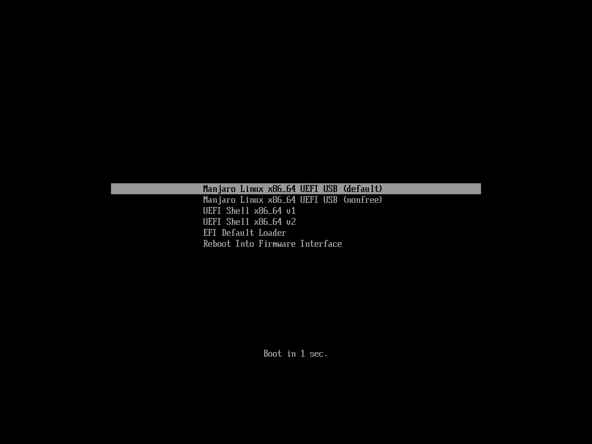

#Automatyczna instalacja w systemach UEFI za pomocą instalatora Calamares

UEFI to uzgodniona nazwa na połączone standardy EFI i UEFI. Nie zawiera starego EFI v1 czy też niestandardowego formatu od Apple.

Nowszy sprzęt zazwyczaj nie używa dobrze znanego BIOSu do zarządzania opcjami bootowania systemu. Zamiast niego, jest używany nowy program zwany UEFI (Unified Extensible Firmware Interface). Ciągle posiada menu podobne do BIOSu oraz tryb *legacy*, który używa BIOS. UEFI często zawiera niesławną opcję *Secure Boot*, która najczęściej jest domyślnie włączona. Społeczność Linuxa jednak zareagaowała na to i rozwinęła środki by zainstalować i uruchomić Linuxa również na tych systemach. Niektóre instalatory jak Calamares mogą nawet automatyzować proces, przez co dla wielu użytkowników nie ma różnicy czy jego maszyna używa UEFI czy BIOS. Trzeba jednak zwrócić uwagę na fakt, że tryb UEFI powinien być instalowany na tablicy partycji GPT. Jeśli jednak dysk posiada tablicę MBR (msdos) Calamares automatycznie zastosuje tryb legacy, a tryb UEFI nie będzie dostępny z poziomu instalatora, jednak do prawidłowego rozruchu po instalacji trzeba włączyć tryb legacy w menu UEFI/BIOSie. Tryb legacy z kolei może być stosowany zarówno na MBR jak GPT.

*Bootowanie w trybie UEFI*

Najważniejszą rzeczą jest upewnienie się, że opcja *Secure Boot* jest wyłączona na twoim komputerze. Tylko bardzo ograniczona liczba systemów operacyjnych uruchomi się jeśli będzie ona włączona. Musisz wyłączyć *Secure Boot* w swoim menu UEFI zanim przejdziesz dalej. Jeśli nie wiesz jak to zrobić, sprawdź dokumentację swojej maszyny, ponieważ może to wyglądać różnie dla różnych komputerów. Jak już uruchomiłeś system z Live CD/DVD/USB zostanie zaprezentowany ekran z opcjami bootowania. Posiada on dwie opcje dla sterowników graficznych (otwarte albo zamknięte/własnościowe). Główną różnicą w porównaniu do instalacji BIOS jest brak opcji językowych. Nie jest to jednak dużym problemem, ponieważ może to być zmienione w sesji live czy ustawione odpowiednio podczas instalacji, przez co system po instalacji będzie w wybranym przez ciebie języku.

1: W trybie UEFI ekran wyboru bootowania wygląda inaczej, ale dwie podstawowe opcje są dalej dostępne.

*Różnice w partycjonowaniu*

Kluczową różnicą w porównaniu do instalacji w trybie BIOS (legacy) jest to, że musi zostać utworzona (jeśli już nie występuje) mała partycja o wielkości 100-250 MB, dla plików używanych podczas startu systemu. Ta partycja musi zawierać system plików fat32 i flagę esp (oraz opcjonalnie flagę boot). Na szczęście w automatycznych instalacjach Calamares zajmie się stworzeniem tej partycji oraz zapisze niezbędne pliki w niej. Jeśli taka partycja już istnieje, instalator ją rozpozna i użyje. Jeśli na tej partycji są już pliki rozruchowe innego systemu (np. Windows lub innej dystrybucji Linux), są one bezpieczne, gdyż Calamares umieści pliki rozruchowe Manjaro w oddzielnym katalogu.

2: Po przejściu do partycjonowania w trybie UEFI widać to w oznaczeniu po lewej, górnej stronie okna, a po prawej, górnej stronie jest oznaczona tablica partycji GPT (niezbędna do trybu UEFI). Z kolei tablica MBR powszechnie spotykana jest w systemach BIOS lub na dyskach zewnętrznych/przenośnych. Na dole ekranu jest wyświetlany obecny schemat partycji z sda1, użytej do przechowywania plików rozruchowych.

*Automatyczna instalacja*

Trzy opcje automatycznej instalacji nie różnią się wiele od tych dostępnych w trybie BIOS. Calamares zajmie się wszystkimi różnicami za ciebie.

*Wyczyść dysk*

1: **Wyczyść dysk** kasuje dysk i tworzy partycję EFI na początku, partycję systemową (root) dla Manjaro i na końcu partycję SWAP (pamięć wirtualna).

*Instaluj obok*

2: Po wybraniu opcji **Instaluj obok** i kliknięciu na partycję do skurczenia, sugerowany podział partycji pojawi się na dole a w przypadku wykrycia istniejącej partycji EFI, instalator Calamares powiadomi o tym.

*Zastąp partycję*

3: Również po wybraniu opcji **Zastąp partycję** instalator powiadomi jeśli znajdzie istniejącą partycję EFI.
