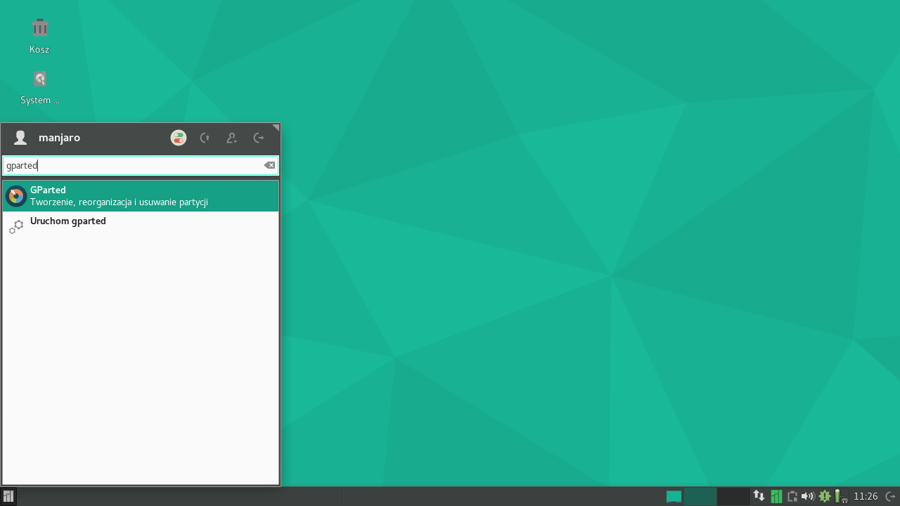

#Instalacja manualna na systemie z UEFI

Manualna opcja instalacji w trybie UEFI różni się najbardziej od pozostałych opcji pokazanych wcześniej. Następujące kroki przeprowadzą cię przez proces tworzenia partycji w trzech różnych scenariuszach. Pierwszy (**Tworzenie partycji od początku**) pokaże jak utworzyć schemat partycji w Calamares bez używania istniejących partycji. Drugi (**Użycie GParted do stworzenia partycji przed instalacją**) pokaże jak stworzyć partycje programem GParted przed użyciem instalatora Calamares. W końcu trzeci scenariusz (**Użycie istniejącej partycji EFI**) przedstawi jak skorzystać z już istniejących partycji włącznie z partycją EFI innego systemu operacyjnego.

*Tworzenie partycji od początku*

Ten scenariusz zakłada, że nie chcesz użyć pojedynczej partycji. Zamiast tego startujesz z kompletnie pustym dyskiem. Tak się właśnie stanie, jeśli użyjesz nowo zakupionego dysku lub instalujesz system na maszynie wirtualnej.

*Stwórz tablicę partycji*

1: Po wybraniu opcji **Ręczne partycjonowanie**, musisz koniecznie utworzyć tablicę partycji typu GPT. Żeby to zrobić, kliknij na przycisk **Nowa tablica partycji** i wybierz **GPT**. Dla przypomnienia o partycjach i partycjonowaniu, sprawdź rozdział **Przydatne definicje**.

2: Wybierz pustą przestrzeń i naciśnij na **Utwórz**. Pierwsza partycja, którą stworzymy, będzie partycją EFI, która będzie zawierać pliki potrzebne do bootowania (startu) systemu.

3: W oknie, które się pojawi, wybierz wielkość między 150-500MB oraz **fat32** jako system plików. Dla przypomnienia o systemach plików, sprawdź rozdział **Przydatne definicje**.

4: Następnie wybierz **/boot/efi** jako punkt montowania. Zawartość tej partycji będzie dostępna w tym katalogi po instalacji Manjaro.

5: W ostatnim kroku wybierz z listy flagi **esp** i **boot**. Jak to zrobisz to kliknij na przycisk **OK**

[SPRAWDZIĆ NAZWĘ PRZYCISKU!!!]

*Tworzenie partycji SWAP*

6: Następną partycją będzie SWAP. Będzie ona użyta jeśli zabraknie ci pamięci RAM lub kiedy będziesz chciał hibernować komputer. Sugerowany rozmiar partycji jest zależny od ilości RAM w systemie. Poniżej 4GB RAM, SWAP powinien mieć co najmniej dwa razy więcej, między 4-8GB RAM, SWAP powinien być równy pamięci RAM, powyżej 8GB RAM, SWAP może mieć mniej (np. połowę). Jeśli nie zamierzacie używać opcji hibernowania systemu, partycja SWAP może być o połowę mniejsza. Zależy to też w dużej mierze od tego, czy używane programy będą zużywać dużo RAMu. W przypadku edycji filmów i innych wymagających sprzętowo programów, SWAP powinien być duży, jednak dla przeciętnego użytkownika nie będzie to miało większego znaczenia, bo w trakcie pracy komputera SWAP jest zwykle rzadko używany, a jeśli już zajdzie taka potrzeba, system i tak znacznie zwalnia, więc lepiej nie dopuszczać do sytuacji braku pamięci RAM. SWAP jest głównie potrzebny do hibernowania systemu i sytuacji awaryjnych, kiedy rzeczywiście procesy będą potrzebować więcej niż jest na pamięci RAM. Sama partycja SWAP nie jest jednak niezbędna do funkcjonowania systemu i niektórzy użytkownicy świadomie z niej rezygnują. Poleca się jednak, żeby ta partycja była obecna.

7: Możesz też kliknąć i przenieść partycję w obrębie nieprzypisanej przestrzeni na dysku, używając paska reprezentującego podgląd dysku w górnej części okna.

*Utwórz inne partycje*

8: Kolejne partycje będą używane przez Manjaro. Tutaj są możliwe różne scenariusze. W tym przykładzie wybieramy najprostszy przypadek, gdzie istnieje tylko jedna partycja zamontowana jako katalog root /. Inny scenariusz, w którym istnieje kolejna partycja zamontowana w katalogu **/home** jest przedstawiony w rozdziale **Manualna instalacja w systemach BIOS za pomocą instalatora Calamares**. Jako system plików polecany jest ext4, ale są również możliwe inne opcje. Dla przypomnienia o systemach plików, sprawdź rozdział **Przydatne definicje**.

*Przejrzyj wybrane opcje i potwierdź*

9: To ostatni etap, w którym można sprawdzić wszystkie wybrane opcje. Po zatwierdzeniu na tym etapie nie będzie możliwości cofnięcia i zmiany.

*Użycie GParted, żeby stworzyć, skasować i zmodyfikować partycje*

Tworzenie partycji i tablicy partycji na przykładach powyżej można też uzyskać przed instalacją w programie GParted, który jest dostępny w sesji Manjaro Live. Edycja Manjaro KDE domyślnie ma dostępny program **Zarządzanie partycjami**, który spełnia podobne funkcje jak GParted jednak jego interfejs graficzny (GUI) może się nieco różnić.

*Utwórz nową tablicę partycji*

1: By utworzyć nową tablicę partycji, wybierz z menu **Urządzenie>Utwórz tablicę partycji...**

2: W oknie, które się pojawi możesz wybrać rodzaj tablicy. Dla systemów UEFI konieczne jest wybranie tablicy **GPT**. Dla przypomnienia o partycjach i partycjonowaniu, sprawdź rozdział **Przydatne definicje**.

3: Zaznacz **nieprzydzielone** i kliknij pierwszy przycisk z lewej, górnej strony okna **Nowa**. Pierwszą partycją będzie partycja EFI.

4: Tak jak w instalatorze Calamares, poleca się utworzenie partycji EFI w wielkości 150-500MB. Możesz zauważyć, że GParted używa innych jednostek dla wielkości partycji, a mianowicie MiB, które nie są równoznaczne z MB, jednak wystarczająco podobne dla twojego użytku. Koniecznie trzeba wybrać system plików **fat32**. Możesz nadać partycji etykietę, żeby była łatwiej rozpoznawalna. Dla przypomnienia o systemach plików, sprawdź rozdział **Przydatne definicje**.

5: Następnie wybierz pozostałą część pustej przestrzeni i stwórz nową partycję. Tym razem będzie to SWAP. Można zaznaczyć i przeciągać partycję na pasku przedstawiającym dysk w górnej części opcja. Ta partycja będzie użyta jeśli zabraknie ci pamięci RAM lub kiedy będziesz chciał hibernować komputer. Sugerowany rozmiar partycji jest zależny od ilości RAM w systemie. Poniżej 4GB SWAP powinien mieć co najmniej dwa razy więcej, między 4-8GB RAM, SWAP powinien być równy pamięci RAM, powyżej 8GB RAM, SWAP może mieć mniej (np. połowę). Jeśli nie zamierzacie używać opcji hibernowania systemu, partycja SWAP może być o połowę mniejsza. Zależy to też w dużej mierze od tego, czy używane programy będą zużywać dużo RAMu. W przypadku edycji filmów i innych wymagających sprzętowo programów, SWAP powinien być duży, jednak dla przeciętnego użytkownika nie będzie to miało większego znaczenia, bo w trakcie pracy komputera SWAP jest zwykle rzadko używany, a jeśli już zajdzie taka potrzeba, system i tak znacznie zwalnia, więc lepiej nie dopuszczać do sytuacji braku pamięci RAM. SWAP jest głównie potrzebny do hibernowania systemu i sytuacji awaryjnych, kiedy rzeczywiście procesy będą potrzebować więcej niż jest na pamięci RAM. Sama partycja SWAP nie jest jednak niezbędna do funkcjonowania systemu i niektórzy użytkownicy świadomie z niej rezygnują, jednak poleca się, żeby ta partycja była obecna.

6: Kolejne partycje będą używane przez Manjaro. Tutaj są możliwe różne scenariusze. W tym przykładzie wybieramy najprostszy przypadek, gdzie istnieje tylko jedna partycja zamontowana jako katalog root /. Inny scenariusz, w którym istnieje kolejna partycja zamontowana w katalogu **/home** jest przedstawiony w rozdziale **Manualna instalacja w systemach BIOS za pomocą instalatora Calamares**. Jako system plików polecany jest ext4, ale są również możliwe inne opcje jak xfs czy btrfs. Dla przypomnienia o systemach plików, sprawdź rozdział **Przydatne definicje**.

7: Dodatkowe flagi są potrzebne, żeby partycja EFI zachowywała się poprawnie. Kliknij na nią prawym przyciskiem myszki i wybierz **Zarządzaj flagami**.

8: W oknie, które się pojawi wybierz **boot** i **esp**. Zamknij okno.

*Zastosuj zmiany*

9: Czas potwierdzić i zastosować wszystkie zmiany. Upewnij się, że wszystko jest w porządku. Pomyłki na tym etapie mogą nieodwracalnie skasować dane na dysku, więc sprawdź czy wybrany jest poprawny dysk, a wszystkie opcje zgodne z tym co chcesz osiągnąć. Jeśli tak tak to kliknij na przycisk **Zastosuj**.

10: To wszystko! Partycje są przygotowane i gotowe do wybrania w instalatorze.

*Użycie istniejącej partycji EFI*

Możliwy jest scenariusz, w którym już posiadasz przygotowane partycje, bo albo je stworzyłeś w programie partycjonowania jak GParted albo zostały utworzone przez inny system. W tym wypadku będziesz chciał użyć istniejącej partycji EFI dla Manjaro.

1: Po wybraniu opcji **Ręczne partycjonowanie**, zaznacz istniejącą partycję EFI i kliknij **Edytuj**.

2: W oknie, które się pojawi wybierz punkt montowania **/boot/efi**. **Jest też opcja formatowania partycji, jednak nie należy tego robić, jeśli chcesz, żeby inne systemy z niej korzystające mogły się uruchamiać.** Instalator Calamares zapisze pliki Manjaro do osobnego katalogu, dzięki czemu nie będą one wpływać na pliki rozruchowe innych systemów. Upewnij się, że są zaznaczone flagi **boot** i **esp**.

3: Następnie wybierz inne partycje dla systemu Manjaro i odpowiednio je zamontuj. Jeśli chcesz instalować obok innego systemu (dual boot), może będziesz musiał zmniejszyć, którąś z istniejących partycji tak jak było to przedstawione w rozdziale **Manualna instalacja w systemach BIOS za pomocą instalatora Calamares**.

4: Jak wszystko jest ustawione, możesz przejść do podsumowania. Jak zawsze, to ostatni etap, w którym możesz przejrzeć swoje wybory i ewentualnie wrócić i je zmienić. Po wybraniu przycisku **Dalej** w podsumowaniu, modyfikacje zostaną zastosowane i instalacja się rozpocznie.
